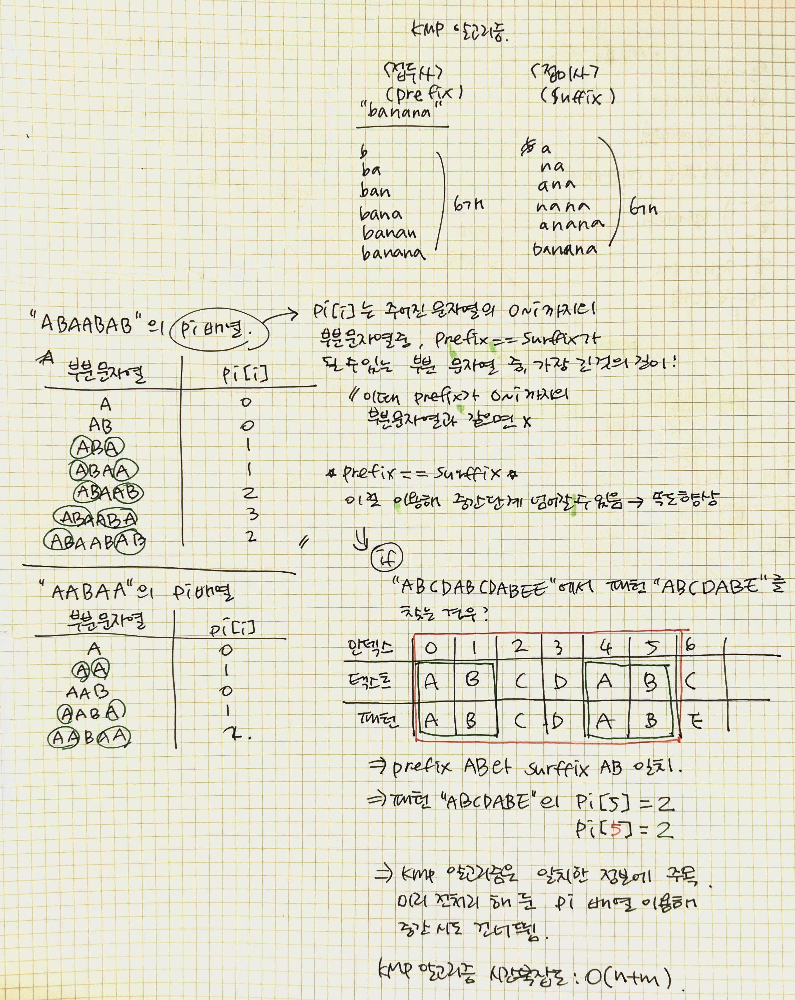

Day 37
===
<h2>JavaScript</h2>  

- <h3>substring</h3>  

-요약: 문자열에서 특정한 구간의 문자열 추출  
-문법: **string.substring(from, to)**  
-인자  

|인자명|데이터형|필수/옵션| 설명 |  
|------|---|---|------|  
|from|number|필수|탐색구간의 시작점(index)|  
|to|number|옵션|탐색구간이 끝나는 점, 0 index부터 시작|  
  
-반환값: string, from과 to 사이의 문자열  
-설명  
<pre>
from과 to 모두 index 0부터 시작하는 위치 값 가짐  
from이 to 보다 작으면 from부터 to 사이의 문자열 리턴  
from이 to 보다 크면 to부터 from 사이의 문자열 리턴  
from과 to가 같으면 빈문자열 리턴  
</pre>
  
[Substring](https://opentutorials.org/course/50/98)  
 
 
  
<h2>Algorithm & Data Structure</h2>  

- <h3>Binary Search(half-interval search)</h3>  
An efficient algorithm for finding an item from a sorted list of items  
데이터가 정렬돼 있는 배열에서 특정한 값 찾아내는 알고리즘  
<pre>
배열의 중간에 있는 임의 값을 선택해 찾고자 하는 값X와 비교  
-> X가 중간 값보다 작으면 중간 값을 기준으로 좌측 데이터들을 대상으로,  
X가 중간 값보다 크면 중간 값을 기준으로 우측 데이터들을 대상으로 다시 탐색  
동일한 방법으로 해당 값을 찾을 때까지 과정 반복  
</pre>
**이진 탐색의 시간 복잡도: O(logN)**  
[Binary Search_wikipedia](https://en.wikipedia.org/wiki/Binary_search_algorithm)  
 

- <h3>KMP Algorithm</h3>  
-**문자열 검색?**  
  
▲ "손흥민"을 검색했을 때 결과 캡쳐 이미지  
 
**문자열 검색**: 본문에서 특정 문자열이나 패턴 찾는 것  
 
  

suffix를 surffix로 표기하다니,,,,,,,,,,,,MY BAD~~~  
[KMP Algorithm_wikipedia](https://en.wikipedia.org/wiki/Knuth%E2%80%93Morris%E2%80%93Pratt_algorithm)  
[KMP Algorithm_blog](https://injae-kim.github.io/dev/2020/07/23/all-about-kmp-algorithm.html)  

 

- <h3>Boyer-Moore Algorithm</h3>  

KMP 알고리즘과 비슷하지만 이건 오른쪽 -> 왼쪽 문자열 비교  
패턴의 마지막 문자부터 역순으로 검사 진행  
일치하지 않는 문자 나타나면 미리 준비된 표(skip table)에 따라 건너뛸 위치 정함  
 
**Bad character shift**  
**Good character shift**  
 
<pre>
**skip 규칙**
문자열 끝부분부터 비교한다.
문자가 일치하면 skip 하지않고 계속해서 비교한다.
불일치 문자가 검색 문자열에 없으면 검색 문자열의 길이 만큼 skip 한다.
불일치 문자가 검색 문자열에 있을 경우, 뒤에서 k 번째에 있다면 (k-1)만큼 skip한다.
비교 과정의 중간에서 불일치 문자를 만나면 skip 테이블의 값에서 앞서 일치한 수 만큼 뺀 값 만큼 skip한다.
</pre>
 

** BM알고리즘의 시간 복잡도: 일반적으로 O(N)보다 적음  
  최악: O(MN)**  
  // 찾으려는 문자열 패턴 길이: M, 총 문자열 길이: N  
<pre>
---최악 예시---
본문이 "AAAAAAAAAAAAAAAA"이고, 검색 문자열이 "BA"일 때 (N-1)M번의 비교 수행
N이 충분히 크다면 O(MN)
</pre>
앞부분보다는 뒷부분에서 불일치 일어날 가능성 높다는 성질 이용  
대체적으로 BM이 KMP보다 빠른 성능 보임  
-> 가장 많이 쓰이는 알고리즘  

[Boyer-Moore Algorithm_naver blog](https://m.blog.naver.com/PostView.naver?isHttpsRedirect=true&blogId=cestlavie_01&logNo=221055516242)  
[Boyer-Moore Algorithm_tistory blog](https://devwooks.tistory.com/12)  
[Boyer-Moore Algorithm_pdf](http://www.cs.jhu.edu/~langmea/resources/lecture_notes/boyer_moore.pdf)  

 

- <h3>Sequential Search(Linear search)</h3>  
선형검색 = 순차검색  
 
데이터가 모인 집합(배열, 링크드리스트 등)의 처음부터 끝까지 하나씩 순서대로 비교하며 원하는 값 찾아내는 알고리즘  
 
-장점  
1) 데이터 정렬 필요없음  
2) 구현 쉬움  

-단점
1) 데이터 양과 검색 속도 비례  
2) 일일히 비교 -> 비효율적  

 

